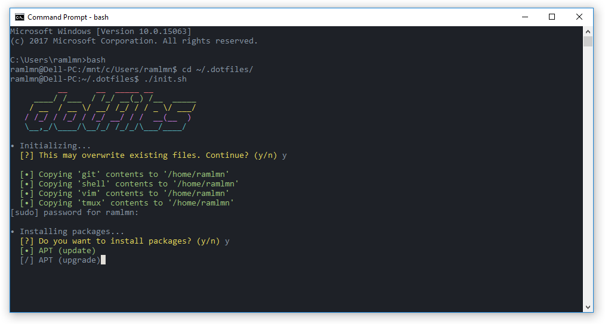
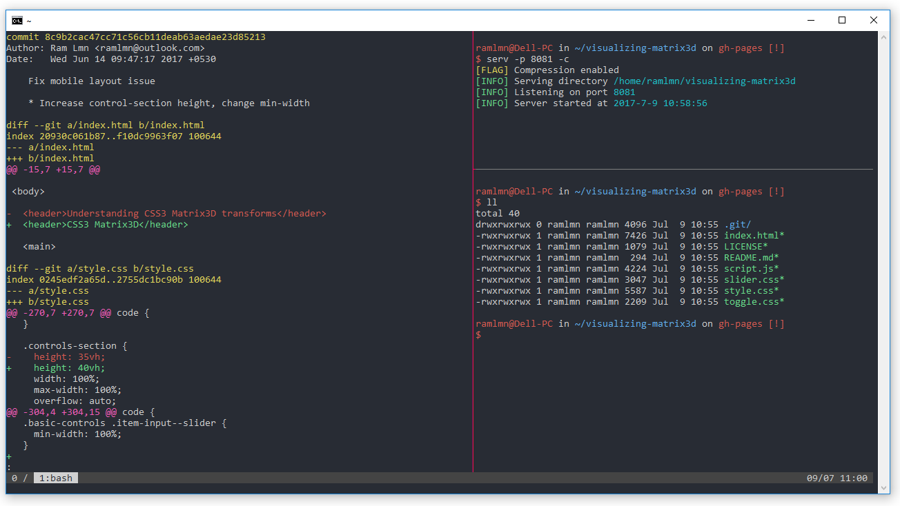

# dotfiles
> Some random dudes dotfiles repository


## Installation
> **Note**: This repository contains code used to configure computer based on how [I](https://github.com/notlmn) like it to be.
> This might be something for you, please review code you find on the internet before you run it.
>
> The script is also assumed to be run in a Debin environment.

``` bash
git clone https://github.com/notlmn/.dotfiles.git
cd .dotfiles
./src/os/setup.sh
```


## Screenshots

<table>
  <tbody>
    <tr>
      <td>
        
      </td>
      <td>
        
      </td>
    </tr>
    <tr align="center">
      <td>Installation</td>
      <td>Vim</td>
    </tr>
  </tbody>
</table>

<table>
  <tbody>
    <tr>
      <td>
        
      </td>
    </tr>
    <tr align="center">
      <td>tmux</td>
    </tr>
  </tbody>
</table>


## Configuration

### Submodules
The stage "Submodules" is kinof optional, used to initialize and update Git's submodules, like Vim's packages.

You can skip this stage while running the script, and run the following commands later.

``` bash
git submodule init
git submodule update
```

### Git configuration
After running the script you might also want to update your Git configuration with the following commands.

``` bash
git config --global user.name <name>
git config --global user.email <email>

# For signing Git commits
git config --global commit.gpgsign true
git config --global user.signingkey <keyid>
```

### Terminal
- Terminal emulator.
  - [Alacritty](https://github.com/jwilm/alacritty), GPU accelerated cross-platform terminal emulator.
  - [Terminal](https://github.com/microsoft/Terminal), new Windows Terminal (when released in future).
- [Snazzy](https://github.com/sindresorhus/hyper-snazzy) theme by Sindre Sorhus.
  - Use [ColorTool](https://github.com/Microsoft/Terminal/tree/master/src/tools/ColorTool) on Windows.
  - Use [Gogh](https://github.com/Mayccoll/Gogh) for Gnome Terminal.

## Acknowledgements
Inspiration and code was intentionally stolen from many sources, including:

- [Cătălin Mariș dotfiles](https://github.com/alrra/dotfiles).
- [Mathias Bynens' dotfiles](https://github.com/mathiasbynens/dotfiles).
- [Paul Irish's dotfiles](https://github.com/paulirish/dotfiles).
- ...and other forgotten sources on the Internet.

## License
Licensed under [MIT](LICENSE).
