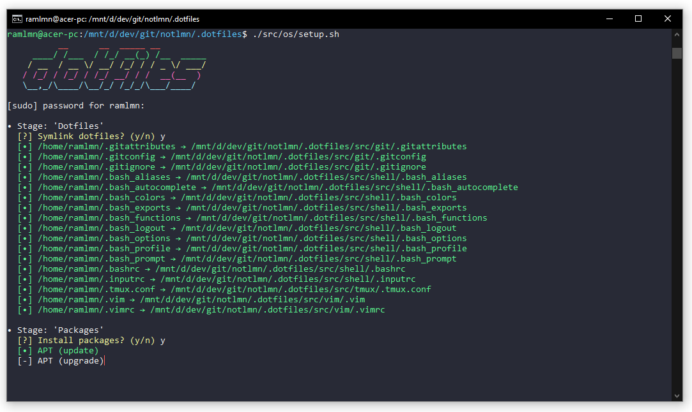

# ramlmn's dotfiles
A slightly strip down customized dotfiles by [alrra](https://github.com/alrra), [mathias](https://github.com/mathiasbynens), and [paulirish](https://github.com/paulirish) specifically tailored for use in Bash-on-Windows (aka. Linux Sub-System for Windows, aka. Bash-on-Ubuntu-on-Windows, aka. WSL, whatever...).

## Installation
``` bash
$ git clone https://github.com/ramlmn/.dotfiles.git
$ cd .dotfiles
$ ./init.sh
```

## Configuration

### Sensible
The `sensible/` contains `init.sh` which is used to run some sensitive tasks (like configuring Git and adding GPG keys). So, mine are excluded (😉) and so should be yours.

### Colors
* Vim is preconfigured to use [one-dark theme by AlexMax](https://github.com/AlexMax/.vim/blob/master/colors/one.vim)
* Suggested colors for customizing `cmd.exe`

  Color        | Hex           | RGB
  -------------|---------------|----------------
  Black        | `#282828`     | `48, 48, 48`
  Blue         | `#3232DC`     | `50, 50, 255`
  Green        | `#32DC32`     | `50, 255, 50`
  Cyan         | `#32DCDC`     | `50, 255, 255`
  Red          | `#FF3232`     | `255, 50, 50`
  Magenta      | `#FF32FF`     | `255, 50, 255`
  Yellow       | `#FFFF32`     | `255, 255, 50`
  Grey         | `#CDCDCD`     | `205, 205, 205`
  White        | `#FFFFFF`     | `255, 255, 255`

### Screenshots

* Installation
  
* Vim
  
* tmux
  

## Acknowledgements
Inspiration and code was taken from many sources, including:

* [Cătălin Mariș dotfiles](https://github.com/alrra/dotfiles)
* [Mathias Bynens' dotfiles](https://github.com/mathialbynens/dotfiles)
* [Paul Irish's dotfiles](https://github.com/paulirish/dotfiles)
* ...and other forgotten sources

## License
Licensed under [MIT](LICENSE)
